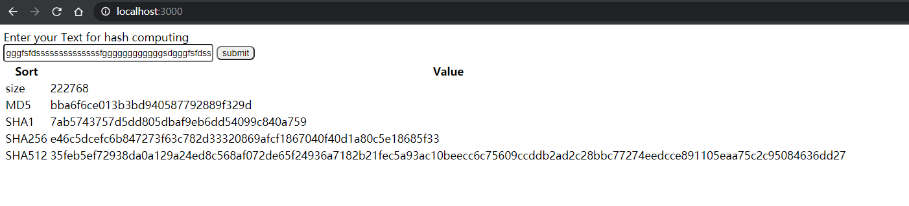

# Hash
This is a `Demo` for hash computing, which forked from https://github.com/second-state/ssvm-nodejs-starter

中文介绍见 https://www.cnblogs.com/yucloud/p/WASM_Rust.html



# Getting started


[Fork this project](https://github.com/second-state/ssvm-nodejs-starter/fork) to create your own Rust functions in Node.js. [Learn more](https://www.secondstate.io/articles/getting-started-rust-nodejs-vscode/)

* The Rust functions are in the `src` directory. You can put high performance workload into Rust functions.
* The JavaScript functions are in the `node` directory and they can access the Rust functions.
* Use the `node node/app.js` command to run the application in Node.js.


## Use Docker to build and run

```
$ docker pull secondstate/ssvm-nodejs-starter:v1
$ docker run -p 3000:3000 --rm -it -v $(pwd):/app secondstate/ssvm-nodejs-starter:v1
(docker) # cd /app
(docker) # ssvmup build
(docker) # node node/app.js
```
in `Windows` PowerShell, please use `${pwd}` to replace $(pwd)

From a second terminal window, you can test the local server.

```
use browser to open with http://localhost:3000/ , then input your string to computing Hash and MD5
```


## Use VSCode Codespace
see: https://github.com/second-state/ssvm-nodejs-starter

### More exercises

Now, you can copy and paste code from [this project](https://github.com/second-state/wasm-learning/tree/master/nodejs/functions).

* `src/lib.rs` --> Replace with [code here](https://github.com/second-state/wasm-learning/blob/master/nodejs/functions/src/lib.rs)
* `Cargo.toml` --> Replace with [code here](https://github.com/second-state/wasm-learning/blob/master/nodejs/functions/Cargo.toml)
* `node/app.js` --> Replace with [code here](https://github.com/second-state/wasm-learning/blob/master/nodejs/functions/node/app.js)

Click on Run to see the build output in Terminal window, and application console output in Debug window.

Try to log into GitHub from the IDE, and use the IDE's GitHub integration features to commit the changes, push the changes back into your forked repository, and perhaps even send us a Pull Request from the IDE!

## Read more:

* [The Case for WebAssembly on the Server-side](https://www.secondstate.io/articles/why-webassembly-server/)
* [Guide on how to Rust and WebAssembly for server-side apps](https://www.secondstate.io/articles/getting-started-with-rust-function/)

## Resources

* [The Second State VM (SSVM)](https://github.com/second-state/ssvm) is a high performance [WebAssembly virtual machine](https://www.secondstate.io/ssvm/) designed for server-side applications.
* [The SSVM NPM addon](https://github.com/second-state/ssvm-napi) provides access to the SSVM, and programs in it, through a Node.js host application.
* [The SSVM ready tool, ssvmup](https://github.com/second-state/ssvmup) is a [toolchain](https://www.secondstate.io/articles/ssvmup/) for compiling Rust programs into WebAssembly, and then make them accessible from JavaScripts via the SSVM.

Brought to you by the Open source dev team at [Second State](https://www.secondstate.io/). Follow us on [Twitter](https://twitter.com/secondstateinc), [Facebook](https://www.facebook.com/SecondState.io/), [LinkedIn](https://www.linkedin.com/company/second-state/), [YouTube](https://www.youtube.com/channel/UCePMT5duHcIbJlwJRSOPDMQ), or [Medium](https://medium.com/wasm)

